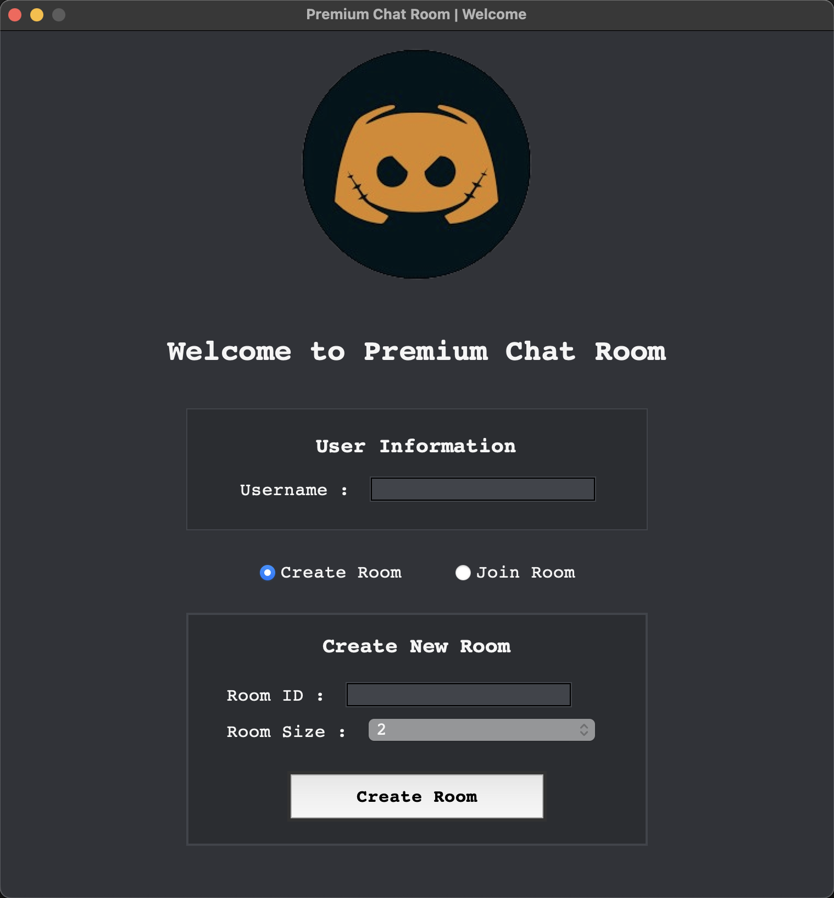
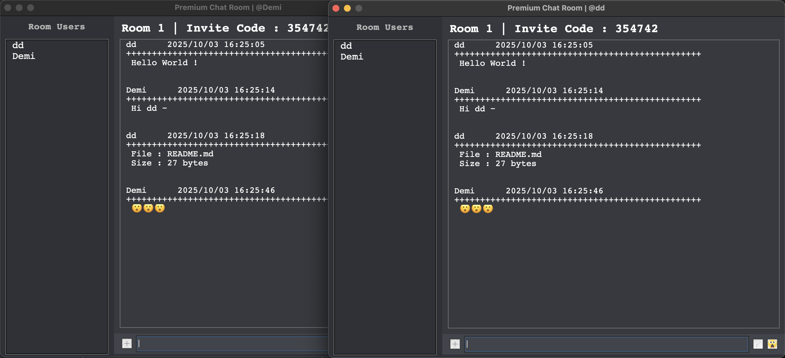

# Secure Premium Chat Room

本專題基於 socket 程式設計，同時運用 TCP 與 UDP 通訊協定，搭配 廣播機制（broadcast） 與 多執行緒（multi-threading）技術，結合 Python Tkinter 圖形介面框架，實作一個聊天室系統。使用者可自行註冊聊天室編號後登入，並與朋友進行專屬對話，聊天室間彼此隔離互不干擾。系統功能包含：新成員加入訊息的廣播、文字與表情符號的傳遞，以及檔案的傳輸。 

## 頁面

- 進入頁面
  
- 聊天頁面
  
